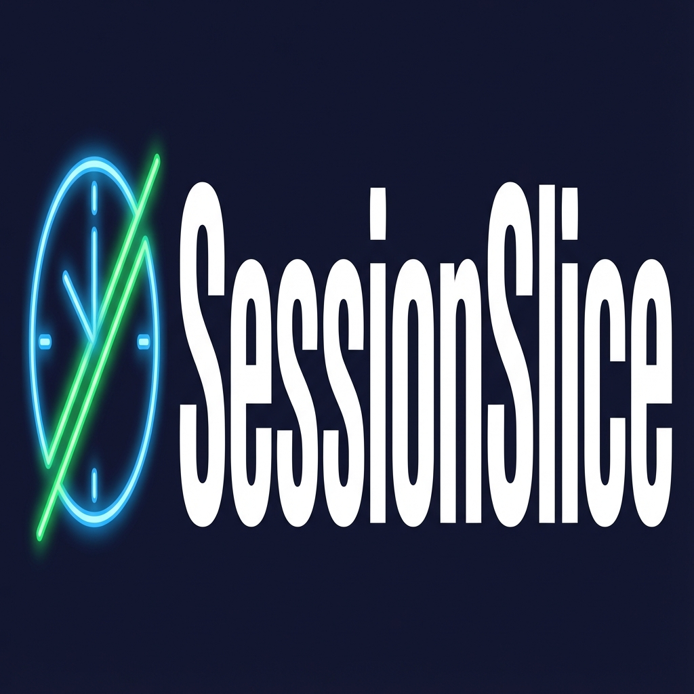

# SessionSlice Productivity Tracker 🎯

**SessionSlice** is a modern, feature-rich productivity application designed to help you manage time, track tasks, and stay focused. Built with Python and CustomTkinter, it combines a powerful focus timer with gamification elements like XP, levels, and achievements to make productivity fun. It now features an integrated **AI Assistant** powered by Hugging Face to provide personalized insights and support.



## ✨ Key Features

*   **⏱️ Focus Timer**: Customizable sessions with "Focus" and "Break" modes. Track duration and interruptions.
*   **✅ Task Management**: Create, manage, and track progress on your daily tasks.
*   **🎮 Gamification**:
    *   **XP & Levels**: Earn XP for every minute styled focused and every completed session.
    *   **Badges & Achievements**: Unlock badges like "Focus Ninja", "Streak Starter", and "Marathon Runner".
*   **🤖 AI Assistant**: Built-in chatbot powered by **Mixtral-8x7B** (via Hugging Face) to answer questions, give productivity tips, and chat.
*   **📊 Analytics**: Visualize your productivity trends with interactive charts (Sessions, Focus Time, Streaks).
*   **🎨 Custom Themes**: Choose from Light, Dark, or colorful themes like Ocean Blue, Nature Green, and Royal Purple.
*   **📅 Calendar & Goals**: Set long-term goals and view your activity on a calendar.
*   **🔔 Smart Notifications**: Get notified when sessions end or when it's time for a break.

## 🛠️ Tech Stack

This project is built using:

*   **Python 3.x**: Core programming language.
*   **CustomTkinter**: For a modern, high-DPI aware user interface.
*   **Matplotlib**: For generating beautiful analytics charts.
*   **Hugging Face API**: For the intelligent AI assistant.
*   **Plyer**: For desktop notifications.

## 🚀 Installation & Setup

### Prerequisites

*   Python 3.8 or higher installed on your system.

### Steps

1.  **Clone or Download** this repository to your local machine.

2.  **Install Dependencies**:
    Open a terminal/command prompt in the project folder and run:
    ```bash
    pip install -r requirements.txt
    ```

3.  **Setup AI (Optional but Recommended)**:
    To enable the AI features, you need a free Hugging Face API key.
    *   Get a key from [Hugging Face Settings](https://huggingface.co/settings/tokens).
    *   Create a `.env` file in the main folder and add:
        ```
        HUGGINGFACE_API_KEY=your_api_key_here
        ```
    *   *Alternatively, you can enter the key directly in the App Settings > AI Integration.*

## ▶️ How to Run

Run the main application file using Python:

```bash
python sessionslice_modern.py
```

## 📂 Project Structure

*   `sessionslice_modern.py`: **Main Application Entry Point**.
*   `ai_assistant.py`: Logic for the AI Chatbot backend.
*   `data/`: Directory where user data (sessions, tasks, profile) is saved locally.
*   `requirements.txt`: List of Python libraries required.
*   `HUGGINGFACE_SETUP.md`: detailed guide on setting up the AI features.

## 🤝 Contributing

Feel free to fork this project and submit pull requests. Suggestions and feature requests are welcome!

---
*Created for the SessionSlice Project.*
